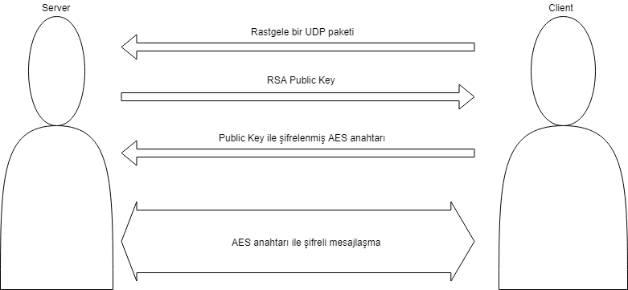

# udp-secure-chat

Bu çalışmada socket programlama ile bir mesajlaşma uygulaması yapılmıştır. Bu mesajlaşma uygulamasında güvenlik katmanları için RSA ve AES kullanılmıştır. RSA asimetrik bir şifreleme yöntemidir. RSA’da iki farklı anahtar vardır bunlar “Public Key” ve “Private Key” olarak adlandırılır. Private Key sadece sahibinde bulunan bir anahtar iken Public Key herkes de bulunabilir. Public Key ile şifrelenmiş bir veri yalnızca Private Key ile açılabilmektedir. Bu durum da Private Key’in internet üzerinde herhangi bir yere gönderilme ihtiyacını ortadan kaldırarak çok iyi bir güvenlik sağlamaktadır. Bu uygulamada RSA sadece AES simetrik anahtarının değişimi için kullanılacaktır. RSA algoritması AES’e göre daha yavaş olduğu için mesajlaşma aşamalarında AES kullanılacaktır. AES yani Advanced Encryption Standard, elektronik verinin şifrelenmesi için sunulan bir standarttır. Amerikan hükûmeti tarafından kabul edilen AES, uluslararası alanda da defacto şifreleme (kripto) standardı olarak kullanılmaktadır. DES'in (Data Encryption Standard) yerini almıştır. AES ile tanımlanan şifreleme algoritması hem şifreleme hem de şifreli metni çözmede kullanılan anahtarların birbiriyle ilişkili olduğu, simetrik-anahtarlı bir algoritmadır. AES için şifreleme ve şifre çözme anahtarları aynıdır. Bu yüzden bu anahtarların internet ortamında gönderilmemesine çok dikkat edilmelidir. Gönderilseler bile farklı bir güvenlik önlemi alınarak gönderilmelidir, bu uygulamada da olduğu gibi AES anahtarı RSA kullanılarak gönderilmiştir.

Çalışmada bir mesajlaşma uygulaması gerçekleştirileceğinden mesajların art arda gönderilmesi gibi durumlar söz konusu olabilir. Fakat normal bir kodlama yapısında biri mesaj gönderirken diğer alma konumunda olmalıdır ki mesajlar iletilebilsin. Bu sorunu çözebilmek için “Thread” kullanılmadır. Ben de projede Java Thread’lerini kullandım. Hem alıcı hem de gönderici tarafda ayrı ayrı 2 Thread çalışmaktadır. Bu Threadlerden biri sürekli mesaj alma durumundayken diğeri sürekli klavyeden giriş alma ve alının metni göndermekten sorumludur.

Sistemin çalışma yapısı aşağıdaki grafikteki gibidir.

Uygulamada UDP paketleri kullanıldığı için başlangıçta bir tarafın herhangi bir UDP paketi göndermesi gerekmektedir. Benim tasarladığım kod yapısında Client tarafı ilk mesajı gönderendir. Server, Client’dan aldığı ilk paketden Client’ın IP adresi ve Port bilgisini çıkarıp bir değişkene kaydetmektedir. Daha sonra Server tarafından oluşturulan RSA anahtar çiftlerinin Public Key’ini Client’a göndermektedir. Client tarafından alınan Server’a ait Public Key kullanılarak Client’ın oluşturduğu AES şifresi encrypt edilip Server’a gönderilir. Server encrypt edilmiş AES anahtarını aldıktan sonra kendi Private Key’i ile bu şifreli metni çözer ve AES anahtarını öğrenmiş olur. Bu şekilde anahtar değişimi tamamlanmış olur. Daha sonraki tüm mesajlaşmalarda bu AES anahtarı kullanılarak mesajlar şifrelenerek güvenli bir iletişim sağlanır.

Çıktılara ait görüntüler aşağıdaki gibidir.

